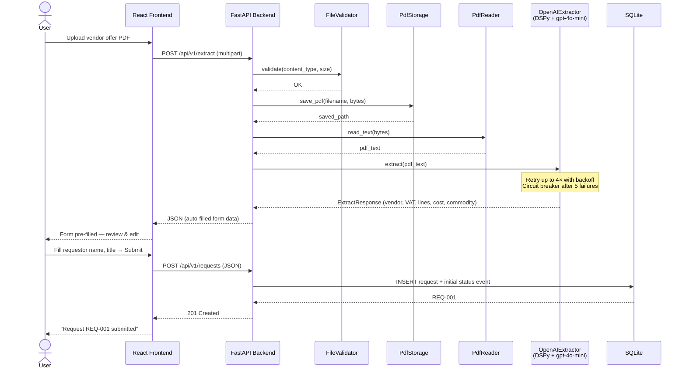

# Procurement Request System

A full-stack application for creating, managing, and tracking procurement requests. Users upload a vendor offer PDF and the system auto-extracts structured fields (vendor, VAT ID, order lines, total cost, commodity group) using AI — eliminating manual data entry.

> See [Use-Case.md](api-backend/Usecase.md) for the original challenge brief.

## Architecture

## Sequence — PDF Upload & Request Creation



## Tech Stack

| Layer | Technology |
|---|---|
| Frontend | React 19, Vite 8, vanilla CSS |
| Backend | Python 3.12, FastAPI, Pydantic v2, SQLAlchemy ORM |
| AI extraction | DSPy, LiteLLM, OpenAI gpt-4o-mini |
| PDF parsing | PyMuPDF (fitz) |
| Database | SQLite (WAL mode, foreign keys) |
| Resilience | tenacity (retry), circuit breaker, async timeout, graceful fallback |
| Security | slowapi rate limiting, CORS, body size limit, path validation, idempotency, API versioning (`/api/v1`) |
| Testing | pytest (31 tests — API layer + service layer) |

---

## Backend Setup

**Prerequisites:** Python 3.12+

```bash
cd api-backend
python -m venv .venv

# Windows
.venv\Scripts\activate
# macOS/Linux
source .venv/bin/activate

pip install -r requirements.txt
```

Create a `.env` file (see `.env.example`):

```
OPENAI_API_KEY=sk-...
```

Run the server:

```bash
uvicorn main:app --host 0.0.0.0 --port 8000
```

Backend starts at **http://localhost:8000**. API docs at **http://localhost:8000/docs**.

Run tests:

```bash
python -m pytest tests/ -v
```

---

## Frontend Setup

**Prerequisites:** Node.js 18+

```bash
cd user-interface/app
npm install
npm run dev
```

Frontend starts at **http://localhost:5173**.

> Make sure the backend is running first — the frontend calls `http://localhost:8000/api/v1`.

---

## Production Considerations

This project is scoped as a local single-user tool per the assignment. For a multi-user production deployment, the following would be added:

- **Authentication & authorisation** — JWT-based auth with role-based access control (e.g. requestor vs. procurement manager), login/logout, and token refresh
- **Database** — PostgreSQL (or similar) replacing SQLite
- **Containerisation** — Docker / Kubernetes
- **CI/CD** — automated pipelines with linting, test, and deploy stages
- **Structured logging** — JSON logs shipped to ELK / Splunk
-- Use **nginx** as a reverse proxy to route API requests to the backend and serve frontend static files efficiently.
